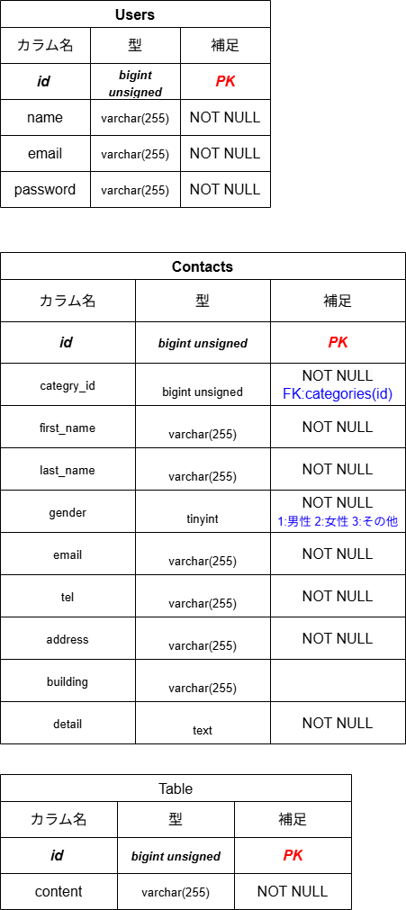

# アプリケーション名
　FashionablyLate  

## 目的
今回は確認テストで行ったコンタクトフォームの復習と追加でtestを実装し、より模擬案件に近い形で確認テストを行うことを目的とする。

##　環境構築(Ubuntsu使用にて構築)
### Dockerビルド
　- git clone git@github.com:ErikoKikuchi/test-contact.git  
　- cd test-contact  
　- git remote set-url origin 作成したリポジトリのurl  
　- docker-compose up -d --build  

### Laravel環境構築
　- docker-compose exec php bash  
　- composer install  
　- composer create-project "laravel/laravel=8.*" . --prefer-dist  
　- 開発環境ではAsia/Tokyoに設定済  
　- cp .env.example .env （DB_HOST=mysql,DB_DATABASE=laravel_db, DB_USERNAME=laravel_user, DB_PASSWORD=laravel_pass）  
　- php artisan key:generate  
　- php artisan migrate  
　- php artisan db:seed  

### 開発環境
　- お問い合わせフォーム入力画面：http://localhost  
　　- 画面フロー：入力確認画面→サンクス画面（フォーム送信経由で遷移）  
　- ユーザー登録：http://localhost/register  
　- ログイン：http://localhost/login  
　　- 画面フロー：管理画面→詳細画面（モーダル表示）（画面内ボタン押下により遷移）  
　- phpMyAdmin:http://localhost:8080  
　- テスト用ログインアカウント  
　　- メール: test@gmail.com  
　　- パスワード: coachtech1106  

##　使用技術（実行環境）
　- php:8.1-fpm（Dockerfile）  
　- Laravel：8.75  
　- MySQL:8.0.26  
　- nginx:1.21.1  

###　データベース設計

### ER図
  

### テーブル概要
　- テーブル名：概要  
　- users:ユーザー情報（管理者画面へのログインユーザー）  
　- contacts:問い合わせ内容  
　- categories:問い合わせ種別  

### カラム仕様
- 全項目にcreated_at,updated_atが含まれる  
  