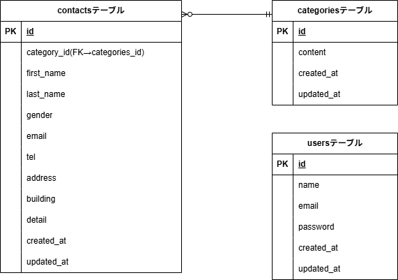

# アプリケーション名　 FashionablyLate

## 目的

今回は確認テストで行ったコンタクトフォームの復習と追加で以下の要件を実装し、より実際の案件に近い形で確認テストを行うことを目的とする。  
\*機能確認のためテストの機能要件とは完全一致はしていない。
1，メール送信（Queue 対応）Mailtrap 使用
2，テストの作成
3，API 化
4，Rate Limit（スパム対策）
5，非同期処理（JS + API）
6，ログ設計（コメントアウトで残す）

##　環境構築(Ubuntu 使用にて構築)

### Docker ビルド

- git clone git@github.com:ErikoKikuchi/test-contact-version2.git  
　- cd test-contact  
　- git remote set-url origin 作成したリポジトリの url  
　- docker-compose up -d --build

### Laravel 環境構築

- docker-compose exec php bash  
　- composer install  
　- composer create-project "laravel/laravel=8.\*" . --prefer-dist  
　- 開発環境では Asia/Tokyo に設定済  
　- cp .env.example .env （DB_HOST=mysql,DB_DATABASE=laravel_db, DB_USERNAME=laravel_user, DB_PASSWORD=laravel_pass）  
　- php artisan key:generate  
　- php artisan migrate  
　- php artisan db:seed

### 開発環境

- お問い合わせフォーム入力画面：http://localhost  
　　- 画面フロー：入力確認画面 → サンクス画面（フォーム送信経由で遷移）  
　- ユーザー登録：http://localhost/register  
　- ログイン：http://localhost/login  
　　- 画面フロー：管理画面 → 詳細画面（モーダル表示）（画面内ボタン押下により遷移）  
　- phpMyAdmin:http://localhost:8080  
　- テスト用ログインアカウント  
　　- メール: test@example.com  
　　- パスワード: password

##　使用技術（実行環境）
　- php:8.1-fpm（Dockerfile）  
　- Laravel：8.75  
　- MySQL:8.0.26  
　- nginx:1.21.1

### ER 図/データベース設計

